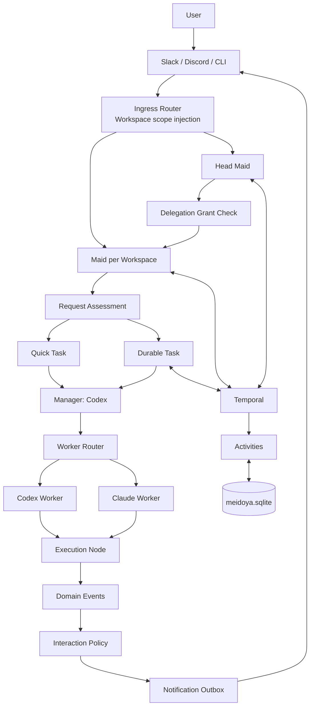

# Architecture

## 1. Logical architecture



## 2. Physical architecture

```text
Host: macOS or Linux
  ├─ meidoyad
  │   ├─ Control Plane API
  │   ├─ Chat Gateway
  │   ├─ Temporal Worker for control workflows
  │   ├─ SQLite writer / repositories
  │   ├─ Notification Outbox publisher
  │   └─ STATUS.md projector
  │
  ├─ Temporal Service
  │
  ├─ meidoya-node (native, optional)
  │   ├─ Codex runtime
  │   └─ Claude runtime
  │
  └─ Lima VM(s), optional
      └─ meidoya-node
          ├─ Codex runtime
          ├─ Claude runtime
          └─ Workspace repositories
```

## 3. Resident Maid

Workspaceごとに常駐するのは、LLM processではなく長寿命のTemporal Workflowです。

```text
WorkspaceMaidWorkflow
  ├─ identity
  ├─ mailbox
  ├─ scope
  ├─ policy revision
  └─ active request references
```

Inbound messageを受けた時だけ`runMaid` ActivityでCodexを起動します。Workflow Historyが増えた場合はContinue-As-Newします。

## 4. Request lanes

### 4.1 Administrative lane

Task一覧、Schedule一覧、cancel、statusなど、LLM実作業が不要な操作です。MaidはControl Plane toolを介して即時処理します。

### 4.2 Quick lane

短い質問や単純な作業です。Maid自身は回答せず、inline TaskとしてManagerと1体のWorkerへ委譲します。

```text
Maid
  → Manager
  → Worker
  → result
  → thread reply
```

設定したsoft deadlineを超えた場合は、同じTask IDのままdurable laneへ昇格します。

### 4.3 Durable lane

調査、コード変更、複数Step、Human Gate、cron、長時間処理です。TaskWorkflowとして実行します。

## 5. Fixed pipelines

MVPでは任意Workflow DSLを導入せず、次の固定パイプラインをコードで提供します。

```text
quick
research
coding
scheduled
cross-workspace
```

各pipelineで設定可能なのは、Human Gate、上限、Quality Gate、Model policyです。Step遷移自体を任意YAMLで変更する機能は後回しにします。

## 6. Coding pipeline

```text
clarify
  ↓
plan
  ↓ optional Plan Gate
implement
  ↓
verify
  ├─ pass → review
  └─ fail → fix
review
  ├─ approved → optional Review Gate → complete
  └─ findings → fix → verify → review
```

Taktから参考にするのは、このようにprocessをAgentのpromptではなく外側のstate machineが所有する点です。

## 7. Cross-workspace flow

```text
User
  ↓
Head Maid
  ↓ grant check
Coordination Task
  ├─ Delegation → Maid(work-it) → local Task
  └─ Delegation → Maid(work-grammarxiv) → local Task
  ↓
Head Maid aggregates summaries
  ↓
User
```

Head Maidは対象Workspaceのpath、Worker、credentialへ直接アクセスしません。

## 8. Control boundaries

| Boundary | Enforcement |
|---|---|
| Workspace | Ingress Binding、scope token、server-side authorization |
| Tool | Role／Task capability policy |
| Filesystem | Node local config、worktree、VM／container、runtime sandbox |
| Workflow | Temporal state machine |
| Notification | Interaction Policy＋Outbox |
| Model | Logical profile allowlist＋Manager proposal validation |
| Human approval | Checkpoint policy＋Temporal wait state |
